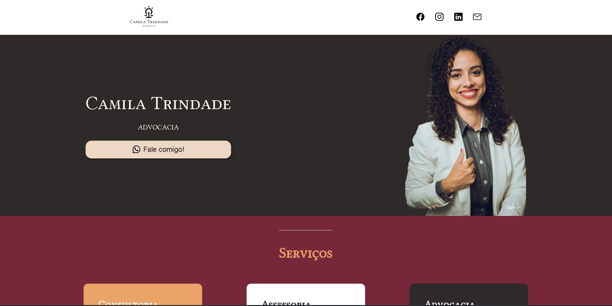
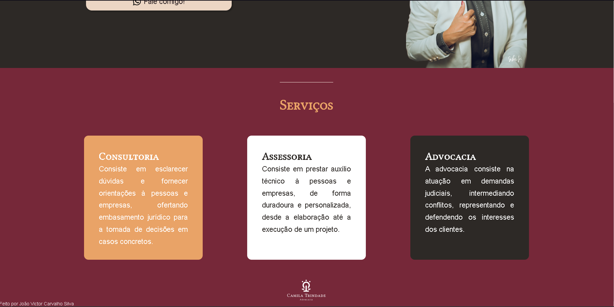

<h1 align="center">Camila Trindade Advogada </h1>

Landing Page profissional.  

  <a href="#-tecnologias">Tecnologias</a>&nbsp;&nbsp;&nbsp;|&nbsp;&nbsp;&nbsp;
  <a href="#-projeto">Projeto</a>&nbsp;&nbsp;&nbsp;|&nbsp;&nbsp;&nbsp;

 

  

  

## 🚀 Tecnologias

Esse projeto foi desenvolvido com as seguintes tecnologias:

- HTML e CSS
- Git e Github

## 💻 Projeto

O Projeto é uma landing page profissional para uma advogada, com descrição de serviços e links para contato.
Construído com o objetivo de treinar e masterizar HTML e CSS.

---

Feito por João Victor Carvalho Silva